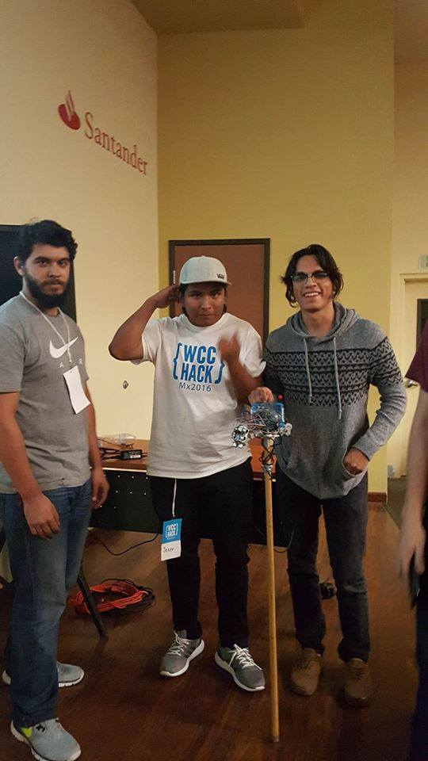

# Hackathon2016
Proyector Ganador del 3er Lugar

Codigo aplicado hecho en el hackathon 2016 en Ensenada, el proyecto consiste en un baston con sensores ultrasonicos, modulo gps+gsm para enviar localizacion de la persona en tiempoo real en caso de emergencia y motores que avisan al usuario donde hay un obstaculo (Izquierda,derecha y enfrente) para personas con debilidades visuales.

